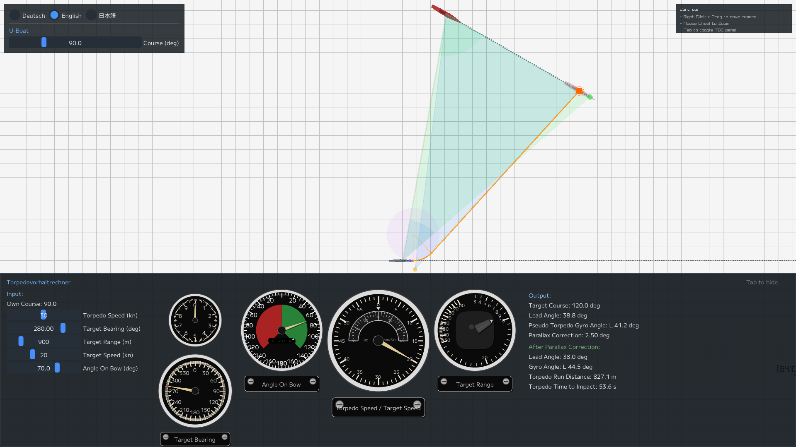

# `seerohr`

<b> Visualize the calculation output of a _Torpedovorhaltrechner_ 🇩🇪 (TDC - Torpedo Data Computer) </b>

<a href="https://james2022-rgb.github.io/seerohr/seerohr.html" target="_blank" rel="noopener">
🌐 Open Web Version
</a>

